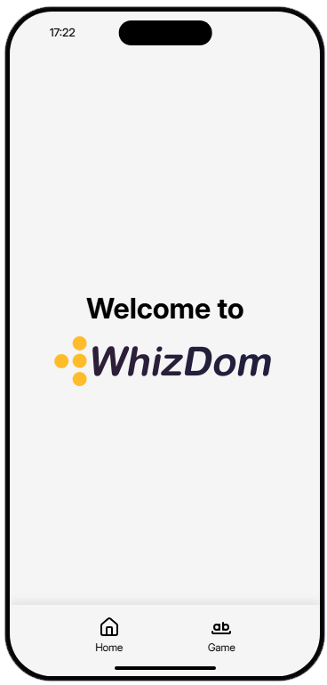
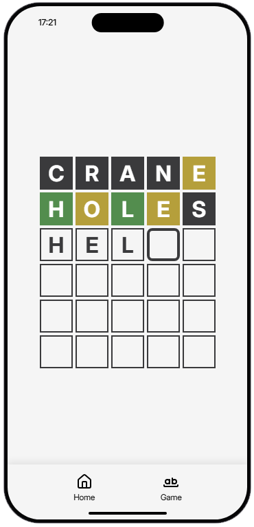
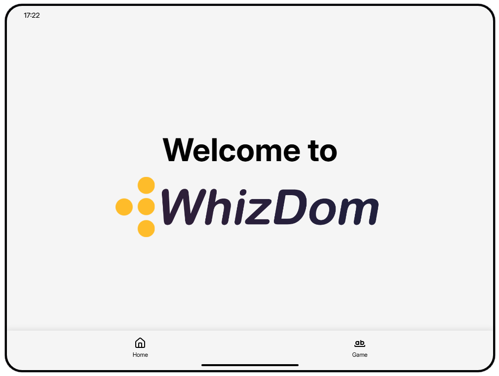
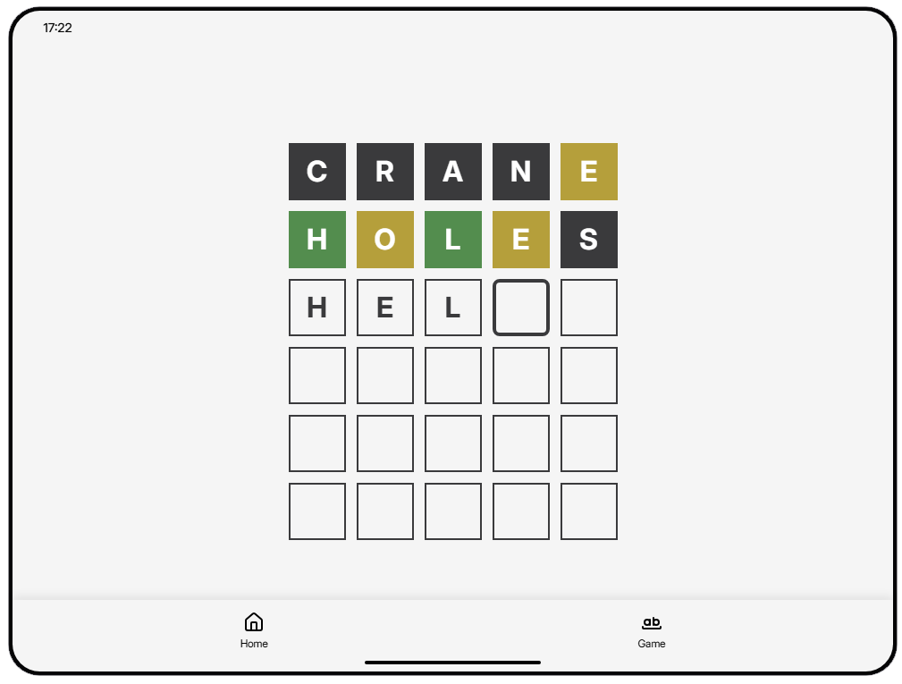

  

  A Wordle © like application for lb-phone.

  
  

  

## WhizDom Screenshots

  
lb-phone

  
  

  
lb-tablet

  
  

## Installing modules

1. Install [bun](https://bun.com/docs/installation)
2. CD to the `ui` folder and run `bun install`, wait for it to complete.

## Developing the app

1. Run `bun dev`
2. Go to `http://localhost:3000` in your browser to see the app in your browser.
3. Refresh and ensure the resource

## Building the app

1. Run `bun build` to build the app. The build will be in the `dist` folder.
2. Change the `ui_page` in the fxmanifest.lua to `"ui/dist/index.html"` (uncomment line 18 & comment out line 19)
3. Refresh and ensure the resource

## Credits
* Random word list: https://random-words-api.kushcreates.com
